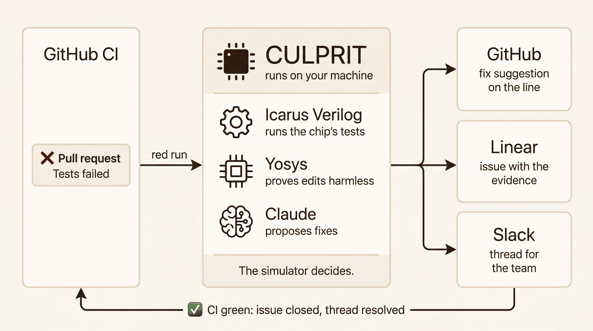
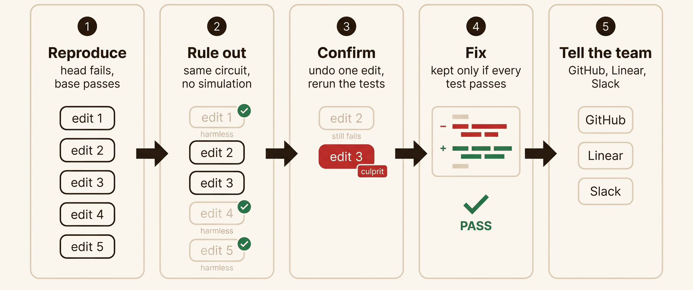
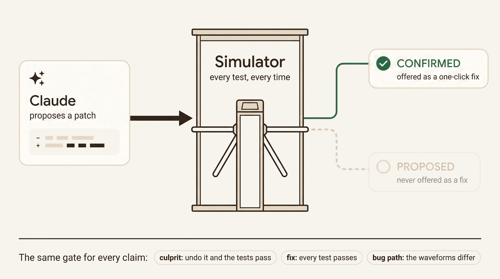
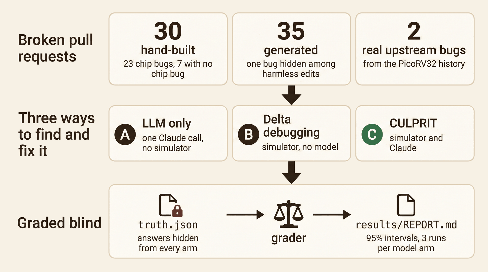

# CULPRIT: system and reliability brief

**A debugging agent for chip teams.** One AI agent across GitHub, Linear and Slack: when a pull request breaks the chip's simulation tests, it proves which line did it, fixes it, and tells the team.

Every number about CULPRIT here was measured and points to where it comes from: `results/REPORT.md`, `runs/`, `tests/`, or a CI run.

## At a glance

| | LLM only | Delta debugging | **CULPRIT** |
|---|---|---|---|
| Fix passes every test (58 broken pull requests) | 51/58 | 54/58 | **58/58** |
| Wrong blame (65 pull requests) | 5/65 | 0/65 | **0/65** |
| Same culprit, fix and blame grades across 3 runs (30 cases) | 27–29/30 | no model | **30/30** |
| Real upstream bugs: fix equals the author's fix | 2/2 | 2/2 | **2/2** |

- **Live, across three apps:** a Test Run went from red CI to a GitHub suggestion, a Linear issue and a Slack thread in 88 s. Replaying a failure creates nothing twice.
- **Portable:** Icarus Verilog 12 and 13 agree on 31/31 runs. CI runs a real investigation on Ubuntu, macOS and Windows (run 34780907902, green).
- **Cheap:** $0.66 of model spend for the 30 hand-built cases, of which 21 needed no model; the 35 generated and 2 upstream cases needed none.

## 1. The problem

Chips are written as code (Verilog) and checked by simulation. When a change breaks the regression, a verification engineer reads logs and waveforms until the guilty line turns up, then carries the answer by hand to the pull request, the tracker and the team chat. Debug is the largest share of that engineer's time (47%, Siemens / Wilson Research Group, as cited by Sigasi), and only 14% of IC/ASIC projects work on first silicon (Siemens / Wilson Research Group, 2024).

## 2. System



| Step | What makes it true | Code |
|---|---|---|
| Watch | the newest completed CI run of each pull request | `apps/github.py`, `culprit.py` |
| Reproduce | head fails and the merge base passes, in Icarus Verilog | `sim/icarus.py` |
| Rule out | identical tokens, or an identical name-blind Yosys netlist: skipped with no simulation | `localize/inert.py` |
| Confirm | undoing that edit alone makes the regression pass | `localize/confirm.py` |
| Fix | restore the line or revert a one-line edit; else a Claude patch; else revert only the edits that carry the bug. Kept only if every test passes | `culprit.py` `repair`, `repair/claude.py` |
| Bug path | each hop's waveform differs between base and head | `surface/propagation.py` |
| Tell | GitHub suggestion and status, Linear issue, Slack thread, through one allow-list | `apps/act.py`, `apps/http.py` |
| Resolve | CI green: issue closed, resolved reply, success status | `culprit.py` `cmd_resolve` |
| Verify | the comment, issue and Slack thread exist once and link to each other | `apps/verify.py` |

It runs on the engineer's machine (`uv tool install git+https://github.com/owizdom/culprit`, then `culprit`), with a desktop window in pywebview and React. On PicoRV32 a clean regression is 471,610 clock cycles (about 15 s), Yosys elaborates the core in 0.24 s, and a three-edit pull request took 4 simulations and 2.8 s with the base result cached.

## 3. How one investigation narrows down



A real one, live PR #1 (`runs/1@ecb8884f857c`). The pull request changed the register-file write on line 1344 from `cpuregs[latched_rd]` to `cpuregs[latched_rd ^ 1'b1]`. CULPRIT reproduced the failure, confirmed the culprit and fixed it in 3 simulations, and traced how the bug reached the failing test:

![Bug path on PR #1: the edit on picorv32.v:1344, then cpuregs[0] (proposed), cpuregs_rs1 at cycle 8,214, reg_out at 8,216, trace_data at 8,217, and the test failing with a write outside memory at cycle 8,222](site/img/brief/bug-path.png)

Solid steps were confirmed by comparing base and head waveforms. `cpuregs[0]` stays proposed because it changes after the next hop.

## 4. Trust model: the simulator is the judge



| Claim | CONFIRMED only when | Otherwise |
|---|---|---|
| Head fails, base passes | two simulations agree | abstain |
| An edit is harmless | identical tokens or identical name-blind netlist | simulate it (never used to blame) |
| An edit is the culprit | undoing it alone makes the regression pass | not blamed |
| A fix works | it passes the regression; a model patch must also stay inside the culprit edit and not be a plain revert | PROPOSED, never a one-click suggestion |
| A bug-path hop | base and head waveforms differ no later than the next hop | PROPOSED |
| The model's explanation | never | PROPOSED |

## 5. Safe across three apps

- **One allow-list** (`apps/http.py`): review comments and statuses on the watched repository, CULPRIT's own issue in one Linear team, posts in one Slack channel. Anything else raises before a network call. The investigation never pushes, merges or approves (`tests/test_apps.py`). The one exception is Test Run, which may open a pull request from a `culprit-test/` branch on the watched repository (`tests/test_testrun.py`).
- **Idempotent:** the Linear issue and Slack parent are keyed per pull request, the comment and thread reply per pull request and commit. Live, PR #1 was published 7 times and holds 1 CULPRIT comment; a replay across all three apps printed `created 0, unchanged 4`.
- **Tokens:** saved only after a live read-only check (GitHub `/user`, Linear `viewer`, Slack `auth.test`), written through a temp file and rename with mode 600; the window only ever sees the last four characters (`tests/test_connect.py`).
- **Watcher:** acts on the newest completed run, retries a failed action up to 3 times and keeps its last error, and resolves only pull requests it investigated (`tests/test_watch.py`).

## 6. Evaluation



- **Arms.** A: one Claude call with the pull request, diff and CI log tail, no simulator. B: delta debugging with the netlist proof, no model. C: CULPRIT, which is B plus the shipped `repair()`. Claude Opus 5 at medium effort.
- **Blind.** Only the corpus builder and the grader read `truth.json` (`tests/test_truth_isolation.py`). The grader applies each fix and simulates it the same way for every arm (`evals/run.py`).
- **Corpora.** 30 hand-built cases: 23 chip bugs (inside an intended multi-line edit, among harmless edits, as a plain edit, or spread over two edits) and 7 that fail for another reason or do not fail. 35 generated cases: one semantic bug among harmless decoy edits (`corpus/mutants/`). 2 real bugs the PicoRV32 author fixed upstream, put back into today's code (`corpus/history/`).

All 65 hand-built and generated cases, with 95% Wilson intervals:

| Metric | A: LLM only | B: Delta debugging | C: CULPRIT |
|---|---|---|---|
| Culprit edit found | 51/58 (77–94%) | 58/58 (94–100%) | **58/58 (94–100%)** |
| Exact line found | 53/58 (81–96%) | 51/58 (77–94%) | 54/58 (84–97%) |
| Fix passes | 51/58 (77–94%) | 54/58 (84–97%) | **58/58 (94–100%)** |
| Fix keeps the author's work | 50/54 (82–97%) | 44/54 (69–90%) | 51/54 (85–98%) |
| Wrong blame | 5/65 (3–17%) | 0/65 (0–4%) | **0/65 (0–4%)** |
| Non-bugs handled correctly | 7/7 | 7/7 | 7/7 |

| Run-to-run (hand-built, 3 runs) | A: LLM only | C: CULPRIT |
|---|---|---|
| Culprit edit found | 19 · 20 · 19 of 23 | 23 · 23 · 23 of 23 |
| Fix passes | 19 · 21 · 19 of 23 | 23 · 23 · 23 of 23 |
| Wrong blame | 2 · 1 · 2 of 30 | 0 · 0 · 0 of 30 |

**What the numbers say.**
- C's edge over A is that every claim is checked: A blamed the wrong edit on 5 of 65 cases and 7 of its 58 fixes do not pass, and nothing in its answer says which. At this sample size the intervals still touch, but C is never behind A on passing fixes or wrong blame, on any corpus or any run.
- C's edge over B is the repair: passing fixes go from 54 to 58 and fixes that keep the author's work from 44 to 51.
- Where C does not win: the exact line is a tie (A 53, C 54). C's four misses are passing fixes placed on another line of the same edit, and the cheap one-line restore drops intended work next to the bug on 3 of 19 hand-built cases.
- On the 2 real upstream bugs all three arms found the culprit, and every fix equals the author's.
- Icarus Verilog 12 and 13 give the same status, trap cycle, failing test and byte-identical log on all 31 runs (`results/icarus12.md`).
- Fixed after the first full run, then re-run: the harness's arm C now calls the product's `repair()`; a longer culprit goes to the model before the revert; and a line A gave on a not-reproduced case no longer counts as a blame (A's wrong blames 3 → 2 of 30).

## 7. Live runs

| Run | What happened | Evidence |
|---|---|---|
| PR #1, investigate | culprit line 1344 confirmed, fix suggested on GitHub, Linear WIS-5, Slack thread | `runs/1@ecb8884f857c` |
| PR #1, resolve | suggestion committed (`f7c6651`), CI green (run 34740402896), WIS-5 Done, Slack resolved reply, success status; running it again wrote nothing | `runs/ledger.jsonl` |
| PR #3, Test Run | CI finished red at 16:45:41 UTC; by 16:47:09 (88 s) the GitHub suggestion, Linear WIS-7 and a Slack parent and reply were posted | CI run 34769493915, `runs/3@304329a059fc/events.jsonl` |
| CI, three OSes | tests, package build and a real investigation of t01 and u-2cab981 on Ubuntu, macOS, Windows | GitHub Actions run 34780907902 |

Failures found by running it for real, each fixed with a test:
1. Slack's `conversations.history` sometimes answers `ok` with no messages (2 of 12 calls a second apart), which could post a duplicate. The lookup now retries and refuses to post (`tests/test_apps.py`).
2. After the Test Run on PR #3, the watcher marked a run handled although its Slack step failed, so it never retried. It now retries and keeps the error (`tests/test_watch.py`).
3. GitHub empties a run's pull request list once the pull request is merged, so the watcher missed PR #2's green run. Runs are now matched through their commit (`tests/test_github_runs.py`).
4. The testbench keeps the firmware path in 128 characters, so a long install path would fail every simulation. The firmware is now passed by a short name (`tests/test_icarus.py`).

## 8. Limits

- The regression is the oracle: bugs it does not catch are invisible. It catches 37 of 40 seeded single-token mutants and 2 of the 11 upstream bugs that still apply.
- The firmware stops at the first failing test, so one failure is visible per run.
- A netlist proof holds for the testbench's parameters only.
- Register-file words are compared one by one, so a hop through memory can stay PROPOSED.
- 65 cases and 3 runs per model arm: small differences between arms are within noise.
- One design, PicoRV32. Another design is a `design:` config section (`design.py`), not yet run on a second design.
- Live investigations ran on macOS and in an Ubuntu 24.04 container; Windows is verified by CI.

## 9. Reproduce

```sh
uv sync
docker build -t culprit-tc sim/                     # only for pull requests that change the firmware
export CULPRIT_CHIP_REPO=/path/to/picorv32-ci       # default: ../picorv32-ci next to this repository
uv run python corpus/make.py --check
uv run python evals/run.py --arms A,B,C && uv run python evals/report.py
uv run python culprit.py local <base> <head> <pr>
uv run pytest -q
```

## 10. Prior art

Delta debugging (Zeller) finds a culprit change without a model. RTL localization and repair: VeriPilot (arXiv 2606.23759), LiK (2409.15186), HWE-Bench (2604.14709), Phoenix-bench (2605.15226), CirFix (ASPLOS 2022). Products: Normal Computing, ChipAgents, Cadence ChipStack, Synopsys AgentEngineer, Siemens Questa One Debug Agent. What CULPRIT adds: every culprit and fix it offers has passed the simulator, and the answer lands in the team's own tools.

Diagrams were drawn with Gemini (`brand/gen.py`); every label in them was checked against the code and the runs above.
