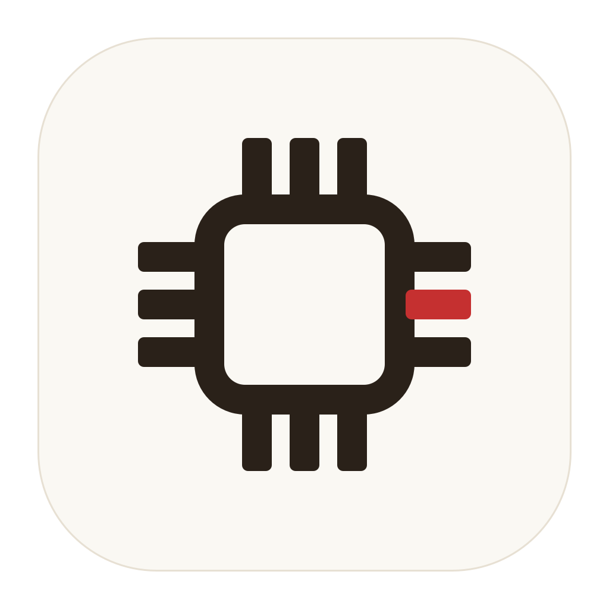
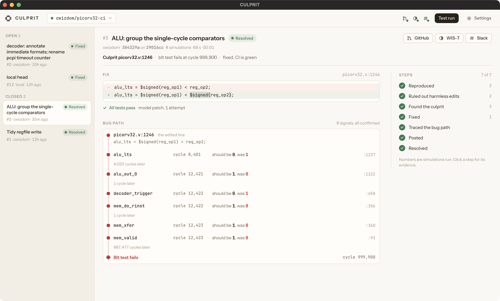

<p align="center"></p>

<h1 align="center">CULPRIT</h1>

<p align="center"><b>A debugging agent for chip teams.</b><br>
One AI agent across GitHub, Linear and Slack: when a pull request breaks the chip's simulation tests, it proves which line did it, fixes it, and tells the team.</p>

<p align="center"><b>Demo video:</b> <i>link to be added</i> · <a href="https://culprit-beige.vercel.app">Website</a> · <a href="BRIEF.md">System &amp; reliability brief</a></p>



## The problem

Chips are written as code (Verilog) and checked by simulation. When a change breaks the regression, an engineer digs through logs and waveforms for the guilty line, then carries the answer by hand to the pull request, the tracker and the team chat. Debug is the largest share of a verification engineer's time (47%, Wilson Research Group), and only 14% of chip projects work on first silicon (Siemens / Wilson Research Group, 2024).

CULPRIT does that loop on its own, from red CI to a proven fix in all three apps.

## How it works

```
GitHub CI turns red on a pull request
    ↓
Reproduce   head fails, merge base passes                  Icarus Verilog
    ↓
Rule out    edits that cannot change the circuit           Yosys netlist proof, no simulation
    ↓
Confirm     undo edits until one makes the tests pass      the culprit, proven
    ↓
Fix         restore the line, or Claude proposes a patch   kept only if every test passes
    ↓
Tell        suggestion on the PR · Linear issue · Slack thread, all closed when CI is green
```

### The simulator is the judge
- A culprit counts only when undoing it makes the tests pass.
- A fix counts only when every test passes; anything else is labelled a proposal.
- The model proposes. It never has the last word.

## Apps it works across

| App | Reads | Writes |
|---|---|---|
| **GitHub** | CI runs, pull requests, code | A one-click suggestion on the culprit line, a commit status |
| **Linear** | Teams, its own issues | One issue per broken pull request with the evidence; moved to Done when CI is green |
| **Slack** | Its own messages | One thread per pull request, kept current; a resolved reply |
| **Claude** | The culprit edit and the pull request's intent | Patch proposals the simulator must pass |

Every write goes through one allow-list and is an upsert, so replaying a failure posts nothing twice. The investigation never pushes, merges or approves.

## Install

```sh
uv tool install git+https://github.com/owizdom/culprit
culprit
```

CULPRIT runs the simulation on your machine, so it needs **Icarus Verilog** and **Yosys**: `brew install icarus-verilog yosys` on macOS, [OSS CAD Suite](https://github.com/YosysHQ/oss-cad-suite-build/releases) on Windows (run `culprit` from PowerShell or Command Prompt; Git Bash puts Git's own DLLs ahead of the suite's). The first run checks those tools, takes a Claude API key, and connects GitHub (sign in), Linear (API key) and Slack (a bot from [`apps/slack_manifest.yaml`](apps/slack_manifest.yaml)). **Test run** then opens a real pull request with a known bug so you can watch the whole loop.

## How reliability was tested

| 65 broken pull requests | **CULPRIT** | Claude alone |
|---|---|---|
| Culprit edit found | **58/58** | 51/58 |
| Fix passes every test | **58/58** | 51/58 |
| Wrong blame (lower is better) | **0/65** | 5/65 |

- **Hidden answers.** 30 hand-built bugs plus 35 generated ones hidden among harmless edits, graded blind.
- **Stable.** Three runs: CULPRIT's grades were identical on all 30 hand-built cases.
- **Real bugs.** Two bugs the PicoRV32 author fixed upstream, put back into today's code: CULPRIT's fix matched the author's.
- **Where the model helps.** CULPRIT's simulator search alone, with no model, already finds every culprit (58/58) with 0 wrong blames; the fix step with Claude takes passing fixes from 54/58 to 58/58.
- **Live.** Publishing the same failure again creates nothing (`created 0, unchanged 4`). Four failures found by running it for real, each fixed with a test. The live runs on PR #1 and PR #3 are in [`runs/`](runs/).
- **Portable.** Icarus Verilog 12 and 13 agree on 31/31 runs. 66 tests, and CI runs a real investigation on macOS, Windows and Linux.
- **Cheap.** $0.02 of model spend per case on average.

Every number, with 95% intervals: [`evals/results/REPORT.md`](evals/results/REPORT.md). Method and limits: [`BRIEF.md`](BRIEF.md).

## Run from source

```sh
git clone https://github.com/owizdom/culprit && cd culprit && uv sync
uv run culprit                    # the app
uv run pytest -q                  # tests
uv run python evals/report.py     # rebuild the results from evals/results/raw
```

Built on [PicoRV32](https://github.com/YosysHQ/picorv32) by Claire Wolf and YosysHQ. Any design with a self-checking Icarus testbench can be described in a `design:` config section ([`design.py`](design.py)).
